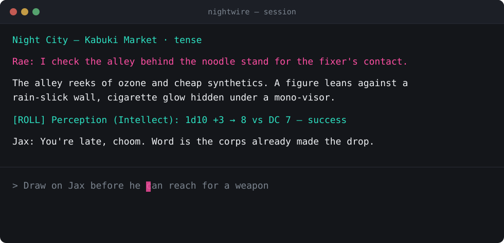
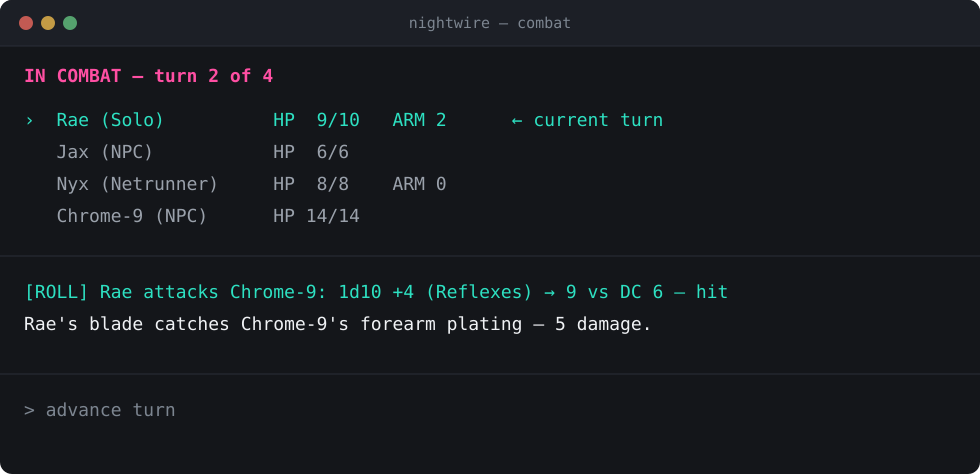
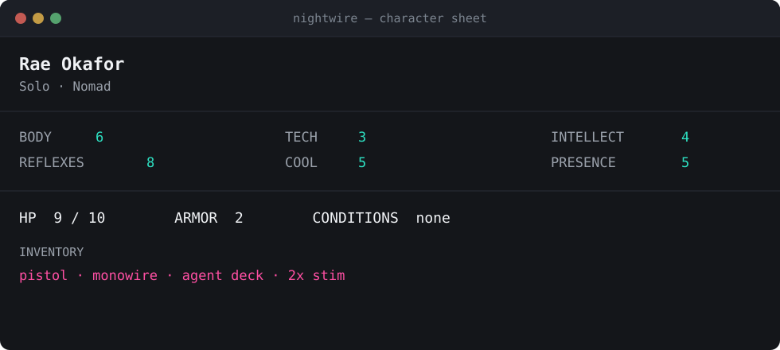

<p align="center">
  <a href="LICENSE"></a>
  
</p>

<p align="center">
  
</p>

<p align="center">
  📖 <a href="ROADMAP.md">Roadmap</a> · <a href="docs/superpowers/specs">Design specs</a>
</p>

A cyberpunk tabletop RPG with an AI game master — playable solo or with friends, in a browser. A homebrew ruleset (`1d10 + attribute + skill` vs. a difficulty class, four roles, six attributes) built specifically for a Cyberpunk-2077-flavored table, not borrowed from D&D.

Sibling project to [`oracle`](https://github.com/Cyb3rRon1n/oracle) (a D&D-flavored AI-DM) — built fresh rather than adapted, and researched independently at every design decision rather than leaning on oracle as precedent (see `ROADMAP.md`'s "Why a fresh project" section for the reasoning, and every spec under `docs/superpowers/specs/` for the citations behind each mechanic).

**Status**: Phases 1–5 built and live-verified — ruleset, engine, AI narrator, web frontend, and image generation all work end to end. Phase 6 (text-to-speech, character-distinct voices) has a committed design spec, not yet implemented. See `ROADMAP.md`'s Phases section for the full build history.

## What makes it Nightwire

- **The server owns all truth.** Character sheets, turn order, combat state — every mechanical number lives in the Python engine (`engine/`). The narrator model only narrates and calls tools (`request_roll`, `apply_character_update`, `update_world`); it never does its own arithmetic.
- **A tiered 1d10 resolution, not d20.** `1d10 + attribute + skill` against a difficulty class, with two success thresholds rather than one — deliberately the lowest-complexity class of cyberpunk system surveyed (Cyberpunk RED, CY_BORG), not Shadowrun-style dice pools.
- **Four roles, independently researched against Cyberpunk 2077 itself**: Solo, Netrunner, Techie, Fixer — CP2077's own three official archetypes plus a Fixer role for the social/negotiation mechanics a video game never had to solve with dice. Six attributes (Body, Reflexes, Tech, Cool, Intellect, Presence) in the same shape as D&D's ability scores.
- **Structured output, not native tool-calling.** `NarratorResponse.tool_call` is a Pydantic discriminated union — the model's tool choice and its arguments are both constrained by a real JSON schema, after live testing found free-form tool-calling inventing plausible-but-wrong argument shapes on nearly every turn.
- **Character-consistent image generation.** A portrait generated once at character approval becomes a reference image for later scene generation, so a character looks recognizably like themselves across separate generations — not a new face every turn. Runs against a local FLUX.2-klein worker, tuned to fit an 8GB card.
- **Local-first AI**, Ollama-backed (`qwen3:8b`), with the same local-first-with-hosted-secondary stance planned for the upcoming TTS backend.

## Running it

Requirements: Python 3.11+, [Ollama](https://ollama.com) with `qwen3:8b` pulled, Node 22+ (frontend build).

```bash
# server
pip install -e ".[dev]"
python -m server                     # ws://localhost:8000

# web frontend (development)
cd frontend && npm ci && npm run dev # http://localhost:3000/nightwire
```

Image generation additionally needs a running `ultra-fast-image-gen` worker (`open-dungeon`'s `image_server/`) on `http://127.0.0.1:7869` — optional; without it, everything except scene/portrait images works normally.

## Repository layout

```
├── ruleset/            # dice resolution, attributes, roles, lifepaths, difficulty
├── engine/             # authoritative session/character/turn state
│   ├── session.py      #   Session dataclass, log, combat state
│   ├── character.py    #   CharacterSheet
│   ├── turns.py        #   join / start_combat / advance_turn / end_combat
│   └── persistence.py  #   JSON session storage
├── narrator/            # the AI game master
│   ├── client.py       #   Ollama client, NarratorResponse schema
│   ├── tools.py         #   tool execution against engine state
│   └── image_backend.py #   ImageBackend protocol + FluxWorkerBackend
├── server/              # WebSocket server (FastAPI)
│   ├── app.py            #   app factory, connection lifecycle
│   ├── dispatch.py       #   incoming message routing
│   ├── narration.py      #   player action -> narrator -> tool/image execution
│   └── views.py          #   per-player state broadcast (redacted for other players)
├── frontend/            # Next.js web client (open-dungeon base, /nightwire route)
├── tests/               # pytest: ruleset, engine, narrator, server
└── docs/                # design specs, implementation plans, branding assets
```

## Screenshots

Mockups in nightwire's own visual style — the actual frontend is still running on `open-dungeon`'s default theme pending its own reskin, so these represent where the UI is headed rather than a literal current screen.

<p align="center">
  <br>
  <sub>Narration, dice rolls, and player actions in one log</sub>
</p>
<p align="center">
  <br>
  <sub>Turn order and combat resolution</sub>
</p>
<p align="center">
  <br>
  <sub>A character sheet — attributes, HP/armor, inventory</sub>
</p>

## Contributing

Solo portfolio project — issues and ideas welcome.

## License

[MIT](LICENSE)
