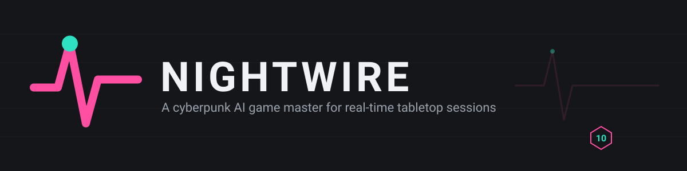
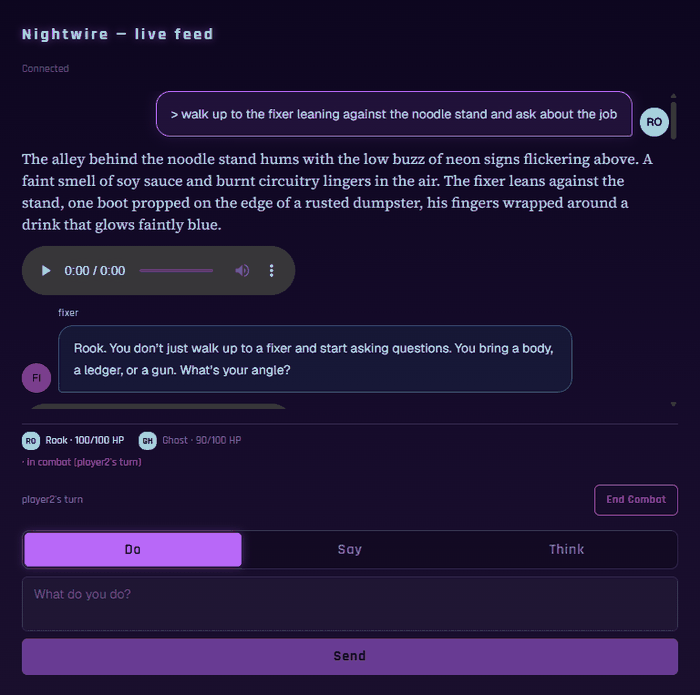
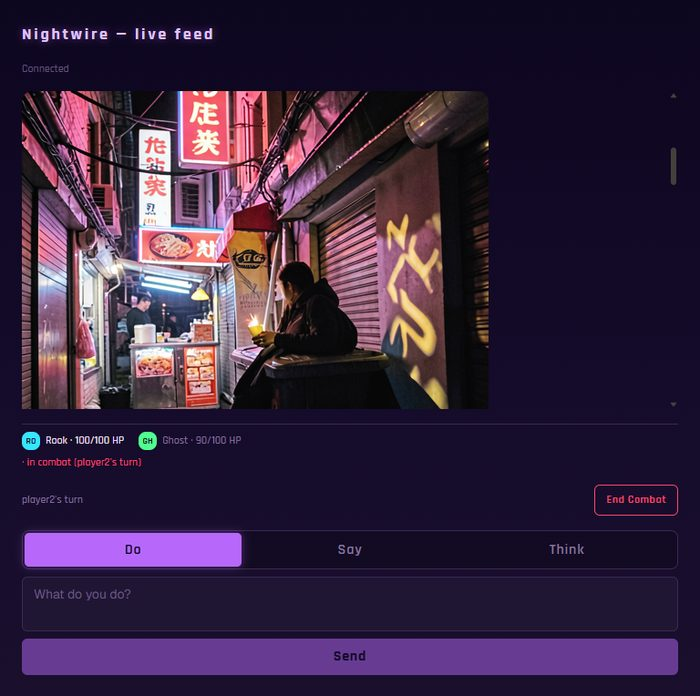

<p align="center">
  <a href="https://github.com/Cyb3rRon1n/nightwire/actions/workflows/ci.yml"></a>
  <a href="LICENSE"></a>
  
</p>

<p align="center">
  
</p>

<p align="center">
  📖 <a href="ROADMAP.md">Roadmap</a> · <a href="docs/superpowers/specs">Design specs</a>
</p>

A cyberpunk tabletop RPG with an AI game master — playable solo or with friends, in a browser. A homebrew ruleset (`1d10 + attribute + skill` vs. a difficulty class, four roles, six attributes) built specifically for a Cyberpunk-2077-flavored table, not borrowed from D&D.

Sibling project to [`oracle`](https://github.com/Cyb3rRon1n/oracle) (a D&D-flavored AI-DM) — built fresh rather than adapted, and researched independently at every design decision rather than leaning on oracle as precedent (see `ROADMAP.md`'s "Why a fresh project" section for the reasoning, and every spec under `docs/superpowers/specs/` for the citations behind each mechanic).

**Status**: Phases 1–9 built and live-verified — ruleset, engine, AI narrator, web frontend, image generation, text-to-speech (character-distinct voices), a skill system, photo-reference portraits, and attribute point-buy all work end to end. See `ROADMAP.md`'s Phases section for the full build history.

## What makes it Nightwire

- **The server owns all truth.** Character sheets, turn order, combat state all live in the Python engine (`engine/`). The narrator model only narrates and calls tools — it never does its own arithmetic.
- **A tiered 1d10 resolution, not d20.** `1d10 + attribute + skill` vs. a difficulty class, deliberately the lowest-complexity class of cyberpunk system surveyed (Cyberpunk RED, CY_BORG), not Shadowrun-style dice pools.
- **Four roles, checked against Cyberpunk 2077 itself**: Solo, Netrunner, Techie, Fixer — CP2077's three official archetypes plus a Fixer for social/negotiation. Six attributes (Body, Reflexes, Tech, Cool, Intellect, Presence).
- **Structured output, not native tool-calling.** The narrator's tool choice and arguments are both constrained by a real JSON schema, after live testing found free-form tool-calling inventing plausible-but-wrong arguments on nearly every turn.
- **Character-consistent image generation.** A portrait generated at character approval becomes a reference image for later scene generation, so a character looks like themselves across turns instead of a new face each time.
- **Local-first AI** — Ollama-backed (`qwen3:8b`), same stance for the TTS backend.

## Running it

Requirements: Python 3.11+, [Ollama](https://ollama.com) with `qwen3:8b` pulled, Node 22+ (frontend build).

```bash
# server
pip install -e ".[dev]"
python -m server                     # ws://localhost:8000

# web frontend (development)
cd frontend && npm ci && npm run dev # http://localhost:3000/nightwire
```

Image generation additionally needs a running `ultra-fast-image-gen` worker (`open-dungeon`'s `image_server/`) on `http://127.0.0.1:7869` — optional; without it, everything except scene/portrait images works normally.

### Run as a Docker stack

```bash
docker compose up -d --build          # server on :8000, web on :3000/nightwire

# local narrator instead of a hosted model:
docker compose --profile ollama up -d --build
docker compose exec ollama ollama pull qwen3:8b
#   ...and in .env:  OLLAMA_HOST=http://ollama:11434

# character-distinct TTS narration:
docker compose --profile voice up -d --build
#   ...and in .env:  KOKORO_URL=http://kokoro:8880   (compose default already points here)
```

Already run Anvil on this host? Point `OLLAMA_HOST` at Anvil's Ollama instead
of the `ollama` profile — one GPU can't usefully feed two.

**Image generation has two backends.** `image_backend.py`'s default
(`IMAGE_BACKEND=flux_worker`) talks to `open-dungeon`'s
`ultra-fast-image-gen` worker, which is MLX-based — Apple Silicon only,
can't run in a Linux container. Set `FLUX_WORKER_URL` if you run that
worker natively on a reachable Mac; there's no shared-volume wiring here
for its output image files, so generated images won't reach the
containerized web frontend without more plumbing. `IMAGE_BACKEND=comfyui`
has no such limitation — it's a plain HTTP client, so it works directly
from the Docker stack. Set `COMFYUI_URL` to a reachable ComfyUI instance.

### Homepage dashboard tile

Co-located Vulcan install with Homepage enabled? Add a click-through tile:

```bash
pip install --user pyyaml   # if not already present
python3 homepage_integrate.py --url http://192.168.1.x:3000/nightwire
```

Auto-detects a sibling `vulcan/stack`; pass `--vulcan-dir` otherwise. Safe to
re-run — only touches its own "Nightwire" group.

## Repository layout

```
├── ruleset/            # dice resolution, attributes, roles, lifepaths, difficulty
├── engine/             # authoritative session/character/turn state
│   ├── session.py      #   Session dataclass, log, combat state
│   ├── character.py    #   CharacterSheet
│   ├── turns.py        #   join / start_combat / advance_turn / end_combat
│   └── persistence.py  #   JSON session storage
├── narrator/            # the AI game master
│   ├── client.py       #   Ollama client, NarratorResponse schema
│   ├── tools.py         #   tool execution against engine state
│   └── image_backend.py #   ImageBackend protocol + FluxWorkerBackend
├── server/              # WebSocket server (FastAPI)
│   ├── app.py            #   app factory, connection lifecycle
│   ├── dispatch.py       #   incoming message routing
│   ├── narration.py      #   player action -> narrator -> tool/image execution
│   └── views.py          #   per-player state broadcast (redacted for other players)
├── frontend/            # Next.js web client (open-dungeon base, /nightwire route)
├── tests/               # pytest: ruleset, engine, narrator, server
└── docs/                # design specs, implementation plans, branding assets
```

## Screenshots

Real captures of the live frontend running its own "Neon Noir" theme — a cyberpunk visual identity independent of `open-dungeon`'s default fantasy-tabletop styling (see `ROADMAP.md`'s Phase 4 entry for the design reasoning).

<p align="center">
  <br>
  <sub>Narration, dice-backed combat, and a speaker avatar next to each dialogue bubble</sub>
</p>
<p align="center">
  <br>
  <sub>A generated scene image for the current location and mood</sub>
</p>

## Contributing

Solo portfolio project — issues and ideas welcome.

## License

[MIT](LICENSE)
